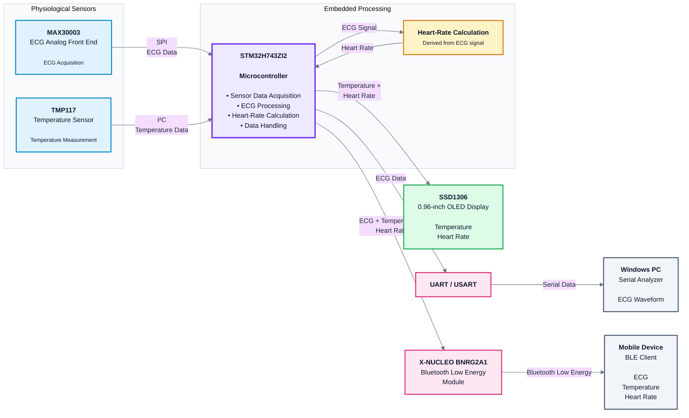

# Wearable Physiological Monitoring System

Embedded C firmware for a wearable physiological monitoring system based on the **STM32H743ZI2** microcontroller.

The project contains drivers and application code for interfacing with physiological sensors and peripherals used for **temperature monitoring, ECG acquisition, heart-rate measurement, display, serial data visualization, and Bluetooth Low Energy (BLE) communication**.

The main focus of this repository is the **embedded firmware and peripheral interfacing** developed for the prototype.

---

## Project Overview

The system uses the STM32H743ZI2 microcontroller as the main processing unit. Different sensors and peripherals are interfaced through standard digital communication protocols such as **SPI, I²C, UART, and GPIO**.

The firmware acquires sensor data, processes the measurements, displays selected values locally, and transfers data through BLE.

### Main Functions

- Temperature measurement
- ECG signal acquisition
- Heart-rate measurement
- OLED display
- 16×2 LCD display
- UART/serial communication
- Bluetooth Low Energy communication
- Sensor driver development
- STM32 peripheral configuration and interfacing

---

## System Architecture

