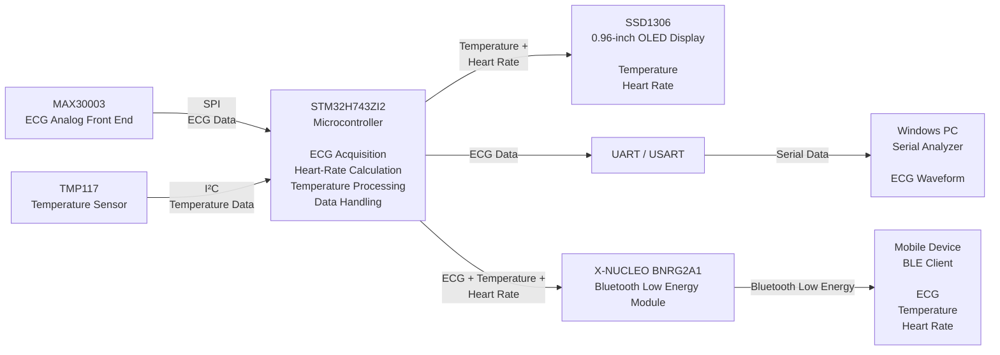

# Wearable Physiological Monitoring System

Embedded C firmware for a wearable physiological monitoring system based on the **STM32H743ZI2** microcontroller.

The project contains drivers and application code for interfacing with physiological sensors and peripherals used for **temperature monitoring, ECG acquisition, heart-rate measurement, display, serial data visualization, and Bluetooth Low Energy (BLE) communication**.

The main focus of this repository is the **embedded firmware and peripheral interfacing** developed for the prototype.

---

## Project Overview

The system uses the STM32H743ZI2 microcontroller as the main processing unit. Different sensors and peripherals are interfaced through standard digital communication protocols such as **SPI, I²C, UART, and GPIO**.

The firmware acquires sensor data, processes the measurements, displays selected values locally, and transfers data through BLE.

### Main Functions

- Temperature measurement
- ECG signal acquisition
- Heart-rate measurement
- OLED display
- UART/serial communication
- Bluetooth Low Energy communication
- Sensor driver development
- STM32 peripheral configuration and interfacing

---
## System Architecture

## Results

The developed firmware was tested on the STM32H743ZI2 with the MAX30003 ECG AFE, TMP117 temperature sensor, SSD1306 OLED, UART interface, and X-NUCLEO BNRG2A1 BLE module.

### Temperature and Heart Rate — SSD1306 OLED

The STM32H743ZI2 processes the temperature data obtained from the TMP117 and calculates heart rate from the ECG acquired through the MAX30003. The **temperature and heart rate** are displayed on the SSD1306 OLED.

  

  <em>Temperature and heart rate displayed on the SSD1306 OLED.</em>

### UART Communication — PuTTY

Sensor data is transmitted from the STM32H743ZI2 through the UART interface to a Windows PC. The serial connection is configured at a **baud rate of 115200**, and the received data can be monitored using PuTTY.

  

  <em>UART data received on the PC using PuTTY at 115200 baud.</em>

### ECG Acquisition — MAX30003

The MAX30003 ECG Analog Front End is interfaced with the STM32H743ZI2 through SPI. The acquired ECG samples are transmitted through UART and visualized on a Windows PC using a Serial Analyzer.

  

  <em>ECG waveform acquired from the MAX30003 and visualized using Serial Analyzer.</em>

### Bluetooth Low Energy — Mobile Monitoring

The STM32H743ZI2 sends the available physiological data through the X-NUCLEO BNRG2A1 Bluetooth Low Energy module. The transmitted data can be monitored on a mobile device using the **nRF Connect** application.

The BLE data includes:

- ECG
- Temperature
- Heart Rate

  

  <em>Physiological data received through BLE and displayed using nRF Connect.</em>

### Final Prototype

The project was developed and tested as a working hardware prototype. The final implementation demonstrates the integration of the STM32H743ZI2, physiological sensors, OLED display, serial communication, and BLE interface.

  

  <em>Final prototype of the physiological monitoring system.</em>

### Results Summary

| Function | Implementation |
|---|---|
| Temperature Acquisition | TMP117 → STM32H743ZI2 via I²C |
| ECG Acquisition | MAX30003 → STM32H743ZI2 via SPI |
| Heart-Rate Calculation | Derived from ECG data |
| OLED Display | Temperature + Heart Rate |
| UART Communication | Sensor data → Windows PC |
| Serial Monitoring | PuTTY @ 115200 baud |
| ECG Visualization | Windows Serial Analyzer |
| BLE Communication | X-NUCLEO BNRG2A1 |
| Mobile Monitoring | ECG + Temperature + Heart Rate via BLE |
